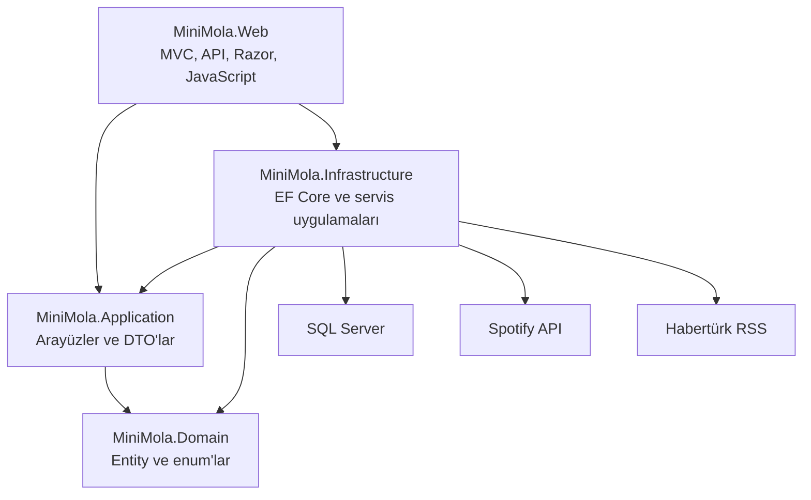

# MiniMola

MiniMola; iş veya günlük hayat sırasında 5–10 dakikalık kısa bir mola vermek isteyen kullanıcılar için geliştirilen, oyunlaştırılmış bir web uygulamasıdır.

Uygulamanın merkezinde her kullanıcıya ait kişisel bir sanal akvaryum bulunur. Kullanıcılar mini oyunları tamamlayarak **Damla** adı verilen puanları kazanır; bu puanlarla yeni balıklar ve dekorasyonlar satın alabilir, akvaryumlarını büyütebilir ve kişiselleştirebilir.

Mini oyunların yanında güncel haberler ve Spotify entegrasyonu da bulunur. Böylece kullanıcı, kısa molası sırasında oyun oynayabilir, akvaryumuyla ilgilenebilir, gündeme göz atabilir veya kendi Spotify hesabından müzik dinleyebilir.

> Projenin mevcut arayüz sürümü: **V2**

---

## İçindekiler

- [Projenin amacı](#projenin-amacı)
- [Özellikler](#özellikler)
- [Ekranlar](#ekranlar)
- [Puan sistemi](#puan-sistemi)
- [Akvaryum sistemi](#akvaryum-sistemi)
- [Oyunlar](#oyunlar)
- [Spotify entegrasyonu](#spotify-entegrasyonu)
- [Haber sistemi](#haber-sistemi)
- [Kullanılan teknolojiler](#kullanılan-teknolojiler)
- [Mimari yapı](#mimari-yapı)
- [Proje klasörleri](#proje-klasörleri)
- [Veritabanı yapısı](#veritabanı-yapısı)
- [API uçları](#api-uçları)
- [Kurulum](#kurulum)
- [Spotify ayarları](#spotify-ayarları)
- [Migration işlemleri](#migration-işlemleri)
- [Frontend geliştirme](#frontend-geliştirme)
- [Güvenlik](#güvenlik)
- [Bilinen sınırlamalar](#bilinen-sınırlamalar)
- [Gelecek planları](#gelecek-planları)

---

## Projenin amacı

MiniMola'nın temel amacı, kullanıcının uzun süreli dikkat gerektiren işlerden kısa süreliğine uzaklaşmasını sağlamaktır.

Uygulama özellikle şu kullanım senaryosu düşünülerek geliştirilmiştir:

1. Kullanıcı iş sırasında kısa bir mola vermek ister.
2. MiniMola hesabına giriş yapar.
3. Günlük oyunlardan birini oynar.
4. Başarılı olursa Damla kazanır.
5. Kazandığı Damlalarla balık veya dekorasyon satın alır.
6. Kendi akvaryumunu zaman içerisinde geliştirir.
7. İsterse gündeme göz atar veya Spotify hesabından müzik dinler.

Bu yapı sayesinde oyunlar yalnızca bağımsız eğlenceler olarak kalmaz; akvaryum gelişimini besleyen ortak bir ilerleme sisteminin parçası olur.

---

## Özellikler

### Kullanıcı sistemi

- ASP.NET Core Identity tabanlı üyelik
- Kullanıcı kayıt ve giriş işlemleri
- Kullanıcıya özel profil
- Kullanıcıya özel puan bakiyesi
- Kullanıcıya özel akvaryum
- Kullanıcıya özel balık ve dekorasyon koleksiyonu
- Oturum açmış kullanıcılar için korumalı sayfalar
- İlk girişte otomatik profil oluşturma

### Akvaryum

- PixiJS ile hazırlanmış etkileşimli sanal akvaryum
- Hareket eden balıklar
- Balık türüne göre farklı hız ve boyut değerleri
- Kullanıcıya özel balık koleksiyonu
- Satın alınan dekorasyonların akvaryumda gösterilmesi
- Dekorasyonları sürükleyerek konumlandırma
- Dekorasyon konumlarının veritabanında saklanması
- Akvaryum seviyesi ve kapasite sistemi
- Damla harcayarak akvaryum yükseltme

### Mini oyunlar

- Günün Kelimesi
- Baloncuk Patlat
- Hafıza Kartları
- Günlük ödül kontrolü
- Tekrarlanan ödülleri engelleyen puan işlem kayıtları
- Türkiye saat dilimine göre günlük oyun takibi

### Mağaza

- Balık mağazası
- Dekorasyon mağazası
- Kullanıcı bakiyesine göre satın alma kontrolü
- Akvaryum seviyesine göre ürün kilidi
- Balık kapasitesi kontrolü
- Satın alınan ürün sayısını gösterme
- Başarılı satın alma sonrasında anlık bakiye güncelleme

### Haberler

- Habertürk RSS akışından güncel manşetler
- Haber başlığı, özeti ve yayın zamanı
- Haberleri kaynak sayfasında açma
- Beş dakikalık bellek önbelleği
- Güvenli RSS/XML işleme

### Spotify

- Kullanıcının kendi Spotify hesabını bağlaması
- OAuth 2.0 ve PKCE tabanlı yetkilendirme
- Çalan içeriği görüntüleme
- Şarkı ve sanatçı arama
- Kullanıcının çalma listelerini görüntüleme
- Şarkı veya çalma listesi oynatma
- Önceki, oynat/duraklat ve sonraki kontrolleri
- Ses seviyesi kontrolü
- Spotify bağlantısını kaldırma
- Süresi dolan access token'ı refresh token ile yenileme
- Token değerlerini korumalı biçimde saklama

### Arayüz

- Responsive V2 tasarım
- Masaüstü ve mobil uyumlu menü
- Ortak renk ve tasarım sistemi
- SVG tabanlı ikonlar
- Oyun, akvaryum, mağaza, haber ve müzik sayfalarında ortak görünüm
- Mobil ekranlar için taşma ve yerleşim düzenlemeleri
- `prefers-reduced-motion` desteği

---

## Ekranlar

| Sayfa | Adres | Açıklama |
|---|---|---|
| Ana sayfa | `/` | MiniMola özelliklerini ve kullanıcı ilerlemesini gösterir |
| Akvaryum | `/Aquarium` | Kullanıcının balıklarını ve dekorasyonlarını gösterir |
| Balık mağazası | `/Shop` | Satın alınabilecek balıkları listeler |
| Dekorasyon mağazası | `/Shop/Decorations` | Akvaryum dekorasyonlarını listeler |
| Günün Kelimesi | `/Games/Word` | Günlük beş harfli kelime oyunu |
| Baloncuk Patlat | `/Games/Bubble` | Süreli refleks oyunu |
| Hafıza Kartları | `/Games/Memory` | Kart eşleştirme oyunu |
| Gündem | `/News` | Habertürk RSS manşetlerini gösterir |
| Müzik | `/Music` | Spotify bağlantısı, arama, listeler ve oynatıcı |
| Gizlilik | `/Home/Privacy` | Uygulamanın gizlilik açıklamaları |
| Giriş | `/Identity/Account/Login` | Identity giriş ekranı |
| Kayıt | `/Identity/Account/Register` | Identity üyelik ekranı |

Ana sayfa dışındaki temel uygulama sayfaları oturum açmış kullanıcılar için korunmaktadır.

---

## Puan sistemi

MiniMola içerisindeki puan biriminin adı **Damla**dır.

Kullanıcılar oyunları tamamlayarak Damla kazanır. Kazanılan Damlalar balık, dekorasyon ve akvaryum yükseltmeleri için harcanır.

Her puan hareketi `PointTransactions` tablosuna kaydedilir. Böylece puanın hangi işlem sonucunda kazanıldığı veya harcandığı takip edilebilir.

### Başlangıç hediyesi

Yeni kullanıcı oluşturulduğunda otomatik olarak:

- **250 Damla**
- Seviye 1 akvaryum
- 5 balık kapasitesi
- Bir adet Mavi Tang
- Başlangıç balığının adı olarak **Maviş**

verilir.

### Oyun ödülleri

| Oyun | Şart | Günlük ödül |
|---|---|---:|
| Günün Kelimesi | Kelimeyi en fazla 6 tahminde bulmak | 30 Damla |
| Baloncuk Patlat | 45 saniyede en az 25 baloncuk patlatmak | 40 Damla |
| Hafıza Kartları | 6 kart çiftinin tamamını bulmak | 60 Damla |

Bir oyunun günlük ödülü aynı kullanıcıya aynı gün içerisinde yalnızca bir kez verilir.

Baloncuk ve hafıza oyunlarının günlük ödül kontrolü `PointTransactions.ReferenceId` alanı üzerinden yapılır.

Örnek referans değerleri:

```text
bubble-game-2026-07-31
memory-game-2026-07-31
word-game-3
```

---

## Akvaryum sistemi

Her kullanıcı profiline bağlı bir akvaryum bulunur.

Akvaryum şu temel bilgilere sahiptir:

- Ad
- Tema anahtarı
- Seviye
- Balık kapasitesi
- Kullanıcı balıkları
- Yerleştirilmiş dekorasyonlar

### Akvaryum seviyeleri

Akvaryum en fazla 5. seviyeye yükseltilebilir.

| Mevcut seviye | Yeni seviye | Yeni kapasite | Yükseltme bedeli |
|---:|---:|---:|---:|
| 1 | 2 | 8 | 300 Damla |
| 2 | 3 | 12 | 700 Damla |
| 3 | 4 | 17 | 1.300 Damla |
| 4 | 5 | 23 | 2.200 Damla |

Yükseltme işlemi sırasında:

1. Kullanıcı bakiyesi kontrol edilir.
2. İşlem serializable veritabanı transaction'ı içerisinde yürütülür.
3. Yükseltme bedeli bakiyeden düşülür.
4. Akvaryum seviyesi ve kapasitesi artırılır.
5. Harcama, puan işlem geçmişine kaydedilir.

### Balık türleri

| Balık | Nadirlik | Fiyat | Gerekli seviye |
|---|---|---:|---:|
| Mavi Tang | Common | Başlangıç balığı | 1 |
| Palyaço Balığı | Common | 200 Damla | 1 |
| Neon Tetra | Uncommon | 450 Damla | 1 |
| Beta Balığı | Rare | 800 Damla | 2 |
| Altın Balık | Rare | 1.200 Damla | 2 |

Her balık türünün kendine ait:

- `AssetKey`
- Hareket hızı
- Görüntü ölçeği
- Nadirlik seviyesi
- Minimum akvaryum seviyesi

değerleri bulunur.

### Dekorasyonlar

| Dekorasyon | Kategori | Fiyat | Gerekli seviye |
|---|---|---:|---:|
| Kıvrımlı Su Bitkisi | Plant | 100 Damla | 1 |
| Volkan Taşı | Rock | 140 Damla | 1 |
| Pembe Mercan | Coral | 160 Damla | 1 |
| Hazine Sandığı | Ornament | 260 Damla | 1 |
| Mini Deniz Feneri | Structure | 500 Damla | 2 |
| Ay Işığı Lambası | Lighting | 750 Damla | 3 |

Kullanıcı dekorasyon satın aldığında ürün akvaryuma yerleştirilir. Kullanıcı dekorasyonu sürüklediğinde normalize edilmiş X ve Y koordinatları API üzerinden veritabanına kaydedilir.

---

## Oyunlar

### Günün Kelimesi

Wordle benzeri bir günlük kelime oyunudur.

Kurallar:

- Kelimeler 5 harflidir.
- Kullanıcının en fazla 6 tahmin hakkı vardır.
- Türkçe karakterler desteklenir.
- Aynı kelime ikinci kez tahmin edilemez.
- Harf sonuçları üç durumla değerlendirilir:
  - `0`: Kelimede yok
  - `1`: Kelimede var ancak yanlış konumda
  - `2`: Doğru konumda
- Başarılı kullanıcı 30 Damla kazanır.
- Oyun tamamlanana kadar doğru cevap API tarafından açıklanmaz.

Mevcut seed verisinde 29 Temmuz 2026 ile 4 Ağustos 2026 arasındaki günlük kelimeler bulunmaktadır. Proje büyüdükçe yeni kelimeler veritabanına veya bir yönetim ekranına eklenebilir.

### Baloncuk Patlat

Kısa süreli bir refleks oyunudur.

- Süre: 45 saniye
- Hedef: 25 baloncuk
- Ödül: 40 Damla
- Günlük ödül: Bir kez

Oyun tarayıcıda çalışır. Son skor API'ye gönderilir ve ödül şartları sunucu tarafında tekrar kontrol edilir.

### Hafıza Kartları

Deniz canlıları temalı kart eşleştirme oyunudur.

- 6 kart çifti
- Toplam 12 kart
- Ödül: 60 Damla
- Günlük ödül: Bir kez
- Tamamlama ve hamle sayısı sunucu tarafında doğrulanır

---

## Spotify entegrasyonu

Spotify bağlantısı MiniMola hesabından bağımsızdır. Her kullanıcı kendi Spotify hesabını bağlar ve kendi müziklerine erişir.

MiniMola, kullanıcının Spotify şifresini görmez veya saklamaz. Yetkilendirme Spotify'ın OAuth ekranı üzerinden gerçekleştirilir.

### İstenen Spotify izinleri

```text
user-read-private
user-read-email
streaming
user-read-playback-state
user-read-currently-playing
user-modify-playback-state
playlist-read-private
user-read-playback-position
```

### Spotify özellikleri

- Access token alma
- Refresh token ile access token yenileme
- Kullanıcı bağlantı durumunu görüntüleme
- Çalan şarkı veya podcast bilgisini alma
- Şarkı ve sanatçı arama
- İlk 20 çalma listesini getirme
- Web Playback SDK ile oynatma
- Oynatmayı MiniMola tarayıcı oynatıcısına aktarma
- Spotify bağlantısını kaldırma

Spotify Web Playback özelliklerinin tamamı için Spotify hesabının uygun oynatma yetkisine sahip olması gerekebilir.

---

## Haber sistemi

Gündem sayfası Habertürk RSS akışını kullanır.

Kullanılan RSS adresi:

```text
https://www.haberturk.com/rss/manset.xml
```

Haber servisi:

- RSS içeriğini `HttpClient` ile alır.
- En fazla 10 haber döndürür.
- HTML etiketlerini haber özetlerinden temizler.
- Yalnızca Habertürk alan adına ait güvenli bağlantıları kabul eder.
- DTD işlemeyi kapatarak XML güvenliğini artırır.
- Sonuçları 5 dakika boyunca memory cache içerisinde saklar.
- Haber başlığı ve özet uzunluklarını sınırlar.
- Her haber için URL üzerinden kararlı bir kimlik üretir.

MiniMola yalnızca haber başlığı ve kısa özetini gösterir. Haberin tamamı kaynak sitede açılır.

---

## Kullanılan teknolojiler

### Backend

- .NET 10
- ASP.NET Core MVC
- ASP.NET Core Web API
- ASP.NET Core Identity
- Entity Framework Core 10
- Microsoft SQL Server
- SQL Server Express
- ASP.NET Core Data Protection
- OAuth 2.0
- PKCE
- Memory Cache
- HttpClient Factory

### Frontend

- Razor Views
- HTML5
- CSS3
- JavaScript
- Bootstrap
- PixiJS 8
- Spotify Web Playback SDK
- esbuild
- Responsive tasarım
- SVG ikonlar

### Geliştirme ortamı

- Visual Studio
- SQL Server Management Studio
- Node.js
- npm
- Windows Authentication

---

## Mimari yapı

MiniMola katmanlı, modüler monolith yapısında geliştirilmiştir.



### MiniMola.Domain

Sistemin temel iş modellerini içerir.

Bu katmanda:

- Entity sınıfları
- Enum değerleri
- Ortak temel entity sınıfı

bulunur.

Domain katmanı başka bir proje katmanına bağımlı değildir.

### MiniMola.Application

Uygulamanın servis sözleşmelerini ve veri taşıma modellerini içerir.

Bu katmanda:

- Servis arayüzleri
- Request modelleri
- Response DTO'ları
- Uygulama soyutlamaları

bulunur.

Application katmanı, Infrastructure implementasyonlarını bilmez.

### MiniMola.Infrastructure

Veritabanı ve dış servis işlemlerini gerçekleştirir.

Bu katmanda:

- `ApplicationDbContext`
- Entity Framework configuration sınıfları
- Migration dosyaları
- Seed verileri
- Servis implementasyonları
- SQL Server bağlantısı
- Spotify servis işlemleri
- Habertürk RSS servisi
- Dependency Injection kayıtları

bulunur.

### MiniMola.Web

Kullanıcı arayüzü ve HTTP giriş noktasıdır.

Bu katmanda:

- MVC Controller'ları
- API Controller'ları
- Razor View'ları
- Identity yapılandırması
- Spotify OAuth yapılandırması
- Middleware
- CSS dosyaları
- JavaScript uygulamaları
- PixiJS akvaryumu

bulunur.

---

## Proje klasörleri

```text
MiniMola
│
├── MiniMola.Domain
│   ├── Common
│   ├── Entities
│   └── Enums
│
├── MiniMola.Application
│   ├── Abstractions
│   ├── Aquariums
│   ├── BubbleGames
│   ├── MemoryGames
│   ├── News
│   ├── Shop
│   ├── Spotify
│   └── WordGames
│
├── MiniMola.Infrastructure
│   ├── Persistence
│   │   ├── Configurations
│   │   ├── Migrations
│   │   └── Seed
│   ├── Services
│   └── DependencyInjection.cs
│
├── MiniMola.Web
│   ├── Areas
│   ├── ClientApp
│   ├── Controllers
│   │   └── Api
│   ├── Middleware
│   ├── Models
│   ├── Properties
│   ├── Views
│   ├── wwwroot
│   │   ├── css
│   │   ├── js
│   │   └── lib
│   ├── Program.cs
│   ├── appsettings.json
│   └── package.json
│
└── MiniMola.slnx
```

---

## Veritabanı yapısı

MiniMola, Microsoft SQL Server ve Entity Framework Core Code First yaklaşımını kullanır.

### Temel tablolar

| Tablo | Açıklama |
|---|---|
| `AspNetUsers` | Identity kullanıcıları |
| `UserProfiles` | MiniMola kullanıcı profilleri ve Damla bakiyesi |
| `Aquariums` | Kullanıcı akvaryumları |
| `FishSpecies` | Satın alınabilir balık türleri |
| `UserFish` | Kullanıcıların sahip olduğu balıklar |
| `DecorationItems` | Mağazadaki dekorasyon tanımları |
| `UserDecorations` | Kullanıcıların satın aldığı dekorasyonlar |
| `PointTransactions` | Kazanılan ve harcanan Damla hareketleri |
| `DailyWordPuzzles` | Günlük kelime tanımları |
| `WordGameSessions` | Kullanıcıların kelime oyunu oturumları |
| `WordGameGuesses` | Kelime tahminleri ve sonuçları |
| `SpotifyConnections` | Kullanıcılara ait Spotify bağlantıları |

Identity tarafından kullanılan rol, claim, login ve token tabloları da veritabanında bulunur.

### Veritabanı bağlantısı

Varsayılan geliştirme bağlantısı:

```json
{
  "ConnectionStrings": {
    "DefaultConnection": "Server=localhost\\SQLEXPRESS;Database=MiniMolaDb;Trusted_Connection=True;MultipleActiveResultSets=true;TrustServerCertificate=True"
  }
}
```

Bu bağlantı Windows Authentication kullanır.

---

## API uçları

Bütün uygulama API'leri oturum açmış kullanıcılar için korunmaktadır.

### Akvaryum

| Metot | Adres | Açıklama |
|---|---|---|
| GET | `/api/aquarium` | Kullanıcının akvaryumunu getirir |
| GET | `/api/aquarium/upgrade` | Yükseltme durumunu getirir |
| POST | `/api/aquarium/upgrade` | Akvaryumu yükseltir |
| PUT | `/api/aquarium/decorations/{id}/position` | Dekorasyon konumunu kaydeder |

### Balık mağazası

| Metot | Adres | Açıklama |
|---|---|---|
| GET | `/api/shop/fish` | Balık mağazasını getirir |
| POST | `/api/shop/fish/{fishSpeciesId}` | Balık satın alır |

### Dekorasyon mağazası

| Metot | Adres | Açıklama |
|---|---|---|
| GET | `/api/shop/decorations` | Dekorasyon mağazasını getirir |
| POST | `/api/shop/decorations/{decorationItemId}` | Dekorasyon satın alır |

### Günün Kelimesi

| Metot | Adres | Açıklama |
|---|---|---|
| GET | `/api/games/word` | Günlük oyunun durumunu getirir |
| POST | `/api/games/word/guess` | Yeni kelime tahmini gönderir |

### Baloncuk Patlat

| Metot | Adres | Açıklama |
|---|---|---|
| GET | `/api/games/bubble` | Günlük oyun ve ödül durumunu getirir |
| POST | `/api/games/bubble/complete` | Oyun skorunu tamamlar |

### Hafıza Kartları

| Metot | Adres | Açıklama |
|---|---|---|
| GET | `/api/games/memory` | Günlük oyun ve ödül durumunu getirir |
| POST | `/api/games/memory/complete` | Eşleşme ve hamle sonucunu gönderir |

### Haberler

| Metot | Adres | Açıklama |
|---|---|---|
| GET | `/api/news/headlines` | Güncel haber başlıklarını getirir |

### Spotify

| Metot | Adres | Açıklama |
|---|---|---|
| GET | `/api/spotify/token` | Geçerli Spotify access token döndürür |
| GET | `/api/spotify/search?query=...` | Spotify üzerinde şarkı arar |
| GET | `/api/spotify/playlists` | Kullanıcının çalma listelerini getirir |

Yazma işlemlerinde antiforgery doğrulaması kullanılmaktadır. JavaScript istekleri token değerini `X-CSRF-TOKEN` başlığıyla gönderir.

---

## Kurulum

### Gereksinimler

Projeyi çalıştırmak için aşağıdaki araçlar gereklidir:

- .NET 10 SDK
- Visual Studio ve ASP.NET web geliştirme bileşenleri
- SQL Server Express
- SQL Server Management Studio
- Node.js
- npm
- Spotify entegrasyonu için Spotify Developer hesabı

Kurulu .NET sürümünü kontrol etmek için:

```powershell
dotnet --version
dotnet --list-sdks
```

Node.js ve npm sürümlerini kontrol etmek için:

```powershell
node --version
npm --version
```

SQL LocalDB kontrolü için:

```powershell
sqllocaldb info
```

MiniMola'nın varsayılan bağlantısı LocalDB yerine:

```text
localhost\SQLEXPRESS
```

sunucusunu kullanır.

### 1. Proje klasörüne geçin

```powershell
Set-Location "C:\Users\KULLANICI_ADI\source\repos\MiniMola"
```

### 2. NuGet paketlerini yükleyin

```powershell
dotnet restore .\MiniMola.slnx
```

### 3. Frontend paketlerini yükleyin

```powershell
Set-Location .\MiniMola.Web
npm.cmd install
```

PowerShell execution policy nedeniyle `npm` komutu çalışmazsa `npm.cmd` kullanılabilir.

### 4. JavaScript dosyalarını paketleyin

```powershell
npm.cmd run build:js
```

### 5. Ana klasöre dönün

```powershell
Set-Location ..
```

### 6. Veritabanını oluşturun veya güncelleyin

```powershell
dotnet ef database update `
  --project .\MiniMola.Infrastructure `
  --startup-project .\MiniMola.Web `
  --context ApplicationDbContext
```

### 7. Projeyi derleyin

```powershell
dotnet build .\MiniMola.slnx
```

### 8. Uygulamayı çalıştırın

```powershell
dotnet run `
  --project .\MiniMola.Web `
  --launch-profile http
```

Uygulama varsayılan olarak şu adreste çalışır:

```text
http://127.0.0.1:5173
```

HTTPS profili kullanılırsa:

```text
https://localhost:7271
```

adresi de kullanılabilir.

---

## Spotify ayarları

Spotify bilgileri güvenlik nedeniyle `appsettings.json` içerisinde tutulmamalıdır.

Bilgiler ASP.NET Core User Secrets içerisine kaydedilmelidir.

### User Secrets tanımlama

Proje ana klasöründeyken:

```powershell
dotnet user-secrets set "Spotify:ClientId" "SPOTIFY_CLIENT_ID" `
  --project .\MiniMola.Web

dotnet user-secrets set "Spotify:ClientSecret" "SPOTIFY_CLIENT_SECRET" `
  --project .\MiniMola.Web
```

Tanımlanan değerleri kontrol etmek için:

```powershell
dotnet user-secrets list `
  --project .\MiniMola.Web
```

Client Secret değeri Git deposuna veya README içerisine eklenmemelidir.

### Spotify Redirect URI

Spotify Developer Dashboard içerisinde aşağıdaki adres tanımlanmalıdır:

```text
http://127.0.0.1:5173/signin-spotify
```

Redirect URI, uygulamanın kullandığı protokol, alan adı ve portla birebir aynı olmalıdır.

Örneğin:

```text
http://localhost:5173/signin-spotify
```

ile:

```text
http://127.0.0.1:5173/signin-spotify
```

Spotify açısından farklı adreslerdir.

---

## Migration işlemleri

### Visual Studio Package Manager Console

Yeni migration oluşturmak için:

```powershell
Add-Migration MigrationAdi `
  -Project MiniMola.Infrastructure `
  -StartupProject MiniMola.Web `
  -Context ApplicationDbContext `
  -OutputDir Persistence\Migrations
```

Veritabanını güncellemek için:

```powershell
Update-Database `
  -Project MiniMola.Infrastructure `
  -StartupProject MiniMola.Web `
  -Context ApplicationDbContext
```

Son migration'ı geri almak için, henüz veritabanına uygulanmadıysa:

```powershell
Remove-Migration `
  -Project MiniMola.Infrastructure `
  -StartupProject MiniMola.Web `
  -Context ApplicationDbContext
```

### .NET CLI

Yeni migration oluşturmak için:

```powershell
dotnet ef migrations add MigrationAdi `
  --project .\MiniMola.Infrastructure `
  --startup-project .\MiniMola.Web `
  --context ApplicationDbContext `
  --output-dir Persistence\Migrations
```

Veritabanını güncellemek için:

```powershell
dotnet ef database update `
  --project .\MiniMola.Infrastructure `
  --startup-project .\MiniMola.Web `
  --context ApplicationDbContext
```

### Mevcut migration'lar

Projede şu migration aşamaları bulunmaktadır:

- Initial Identity
- Aquarium domain modelleri
- Başlangıç balık türleri
- Palyaço Balığı fiyat güncellemesi
- Günlük kelime oyunu
- Spotify bağlantıları
- Spotify nullable alan düzenlemesi
- Dekorasyon ürünleri

---

## Frontend geliştirme

JavaScript kaynak dosyaları:

```text
MiniMola.Web/ClientApp
```

klasöründe bulunur.

Üretilmiş bundle dosyaları:

```text
MiniMola.Web/wwwroot/js
```

klasörüne yazılır.

`wwwroot/js` içerisindeki `.bundle.js` dosyaları doğrudan düzenlenmemelidir. Değişiklikler `ClientApp` içerisindeki kaynak dosyalarda yapılmalıdır.

### Tek seferlik build

```powershell
Set-Location .\MiniMola.Web
npm.cmd run build:js
```

### İzleme modu

```powershell
npm.cmd run watch:js
```

İzleme modu açıkken `ClientApp` içerisindeki değişiklikler otomatik olarak bundle dosyalarına aktarılır.

### JavaScript giriş noktaları

- `aquarium.js`
- `shop.js`
- `decoration-shop.js`
- `word-game.js`
- `bubble-game.js`
- `memory-game.js`
- `news.js`
- `music-player.js`

PixiJS yalnızca akvaryum tarafında bundle içerisine dahil edilir.

---

## Güvenlik

Projede uygulanan temel güvenlik önlemleri:

- ASP.NET Core Identity
- `[Authorize]` ile sayfa ve API koruması
- Antiforgery token doğrulaması
- `X-CSRF-TOKEN` başlığı
- Spotify OAuth 2.0
- PKCE
- Client Secret değerinin User Secrets içerisinde tutulması
- Spotify token değerlerinin Data Protection ile korunması
- Harcama ve ödül işlemlerinde veritabanı transaction'ları
- Kullanıcı verilerinin Identity kullanıcı kimliğine göre filtrelenmesi
- RSS XML işlemlerinde DTD'nin kapatılması
- RSS bağlantılarında alan adı kontrolü
- Dış bağlantılarda `noopener noreferrer`
- Hassas Spotify API cevaplarında cache'in kapatılması
- Sunucu tarafında bakiye, seviye ve kapasite doğrulaması

Frontend tarafından gönderilen fiyat, bakiye veya ödül bilgilerine güvenilmez. Kritik hesaplamalar servis katmanında gerçekleştirilir.

---

## Bilinen sınırlamalar

Mevcut geliştirme sürümünde:

- Uygulama yerel SQL Server Express ile çalışmaktadır.
- Otomatik test projesi henüz bulunmamaktadır.
- Yönetici paneli bulunmamaktadır.
- Günlük kelimeler seed verisiyle eklenmektedir.
- Balık ve dekorasyon görselleri programatik olarak çizilmektedir.
- Akvaryum için farklı tema mağazası henüz bulunmamaktadır.
- Spotify kullanılabilirliği Spotify hesabının yetkilerine ve Spotify servis durumuna bağlıdır.
- Haber sistemi Habertürk RSS akışının erişilebilir olmasına bağlıdır.
- E-posta doğrulaması henüz etkin değildir.
- Puan işlem geçmişi kullanıcı arayüzünde henüz gösterilmemektedir.
- Uygulama şu anda modüler monolith mimarisindedir; microservice değildir.

---

## Gelecek planları

Planlanan veya değerlendirilebilecek geliştirmeler:

### Akvaryum

- Balıklara isim verme ve isim değiştirme
- Balıkların açlık ve mutluluk değerleri
- Balıkları besleme
- Balık animasyonlarını geliştirme
- Akvaryum arka plan temaları
- Gece ve gündüz görünümü
- Balık nadirlik efektleri
- Dekorasyon döndürme ve ölçeklendirme
- Dekorasyon envanteri
- Balıkların akvaryuma eklenip çıkarılması

### Oyunlar

- Sudoku
- Mini yapboz
- Renk eşleştirme
- Hızlı matematik
- Günlük görevler
- Seri tamamlama sistemi
- Haftalık skor tabloları
- Başarım sistemi

### Kullanıcı sistemi

- Profil fotoğrafı
- Kullanıcı adı değiştirme
- Puan hareketleri ekranı
- Başarı rozetleri
- Günlük giriş ödülü
- Arkadaş sistemi
- Akvaryum paylaşma

### Teknik geliştirmeler

- Unit test ve integration test projeleri
- Docker desteği
- CI/CD pipeline
- Merkezi loglama
- Redis cache
- Background job sistemi
- Yönetici paneli
- Sağlık kontrolü endpoint'leri
- Rate limiting
- Production secret yönetimi
- Bulut veritabanı desteği
- Microservice mimarisine aşamalı geçiş

---

## Microservice'e geçiş ihtimali

MiniMola şu anda modüler monolith olarak geliştirilmiştir. Domain, Application, Infrastructure ve Web katmanlarının ayrılmış olması gelecekte servislerin bölünmesini kolaylaştırır.

İleride ihtiyaç oluşursa aşağıdaki alanlar bağımsız servislere ayrılabilir:

```text
Identity Service
Aquarium Service
Game Service
Point Service
Content/News Service
Spotify Integration Service
```

Ancak mevcut geliştirme aşamasında modüler monolith yapı daha az operasyonel yük oluşturduğu için daha uygundur.

Microservice geçişi; kullanıcı sayısı, trafik, ekip büyüklüğü ve bağımsız ölçeklendirme ihtiyacı ortaya çıktığında değerlendirilmelidir.

---

## Proje durumu

MiniMola'nın mevcut sürümünde aşağıdaki ana sistemler çalışmaktadır:

- [x] Kullanıcı kayıt ve giriş sistemi
- [x] Otomatik kullanıcı profili oluşturma
- [x] Damla puan sistemi
- [x] Kişisel akvaryum
- [x] Hareketli balıklar
- [x] Balık mağazası
- [x] Dekorasyon mağazası
- [x] Dekorasyon konumu kaydetme
- [x] Akvaryum seviye sistemi
- [x] Günün Kelimesi
- [x] Baloncuk Patlat
- [x] Hafıza Kartları
- [x] Habertürk RSS haberleri
- [x] Spotify OAuth bağlantısı
- [x] Spotify şarkı arama
- [x] Spotify çalma listeleri
- [x] Spotify web oynatıcısı
- [x] Responsive V2 arayüz
- [ ] Yönetici paneli
- [ ] Otomatik testler
- [ ] Production deployment
- [ ] Balık isim değiştirme
- [ ] Günlük görev ve başarı sistemi

---

## Not

MiniMola eğitim ve kişisel geliştirme amacıyla oluşturulan bir projedir.

Habertürk ve Spotify içerikleri ilgili platformlar tarafından sağlanmaktadır. MiniMola bu platformlarla resmî bir ortaklık iddiasında bulunmaz.

Spotify, Spotify AB'nin ticari markasıdır. Haber içeriklerinin hakları ilgili yayıncıya aittir.
