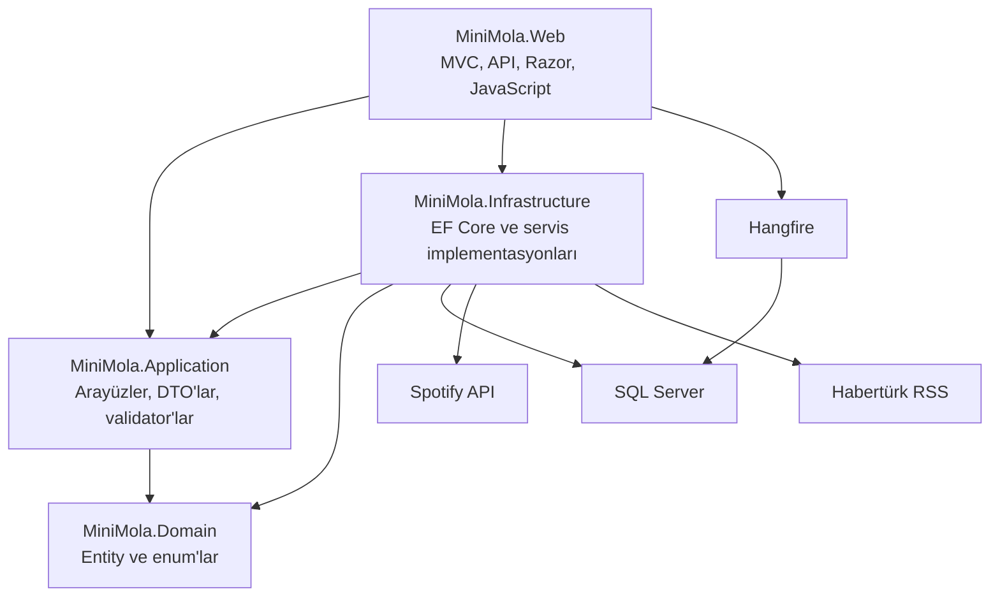
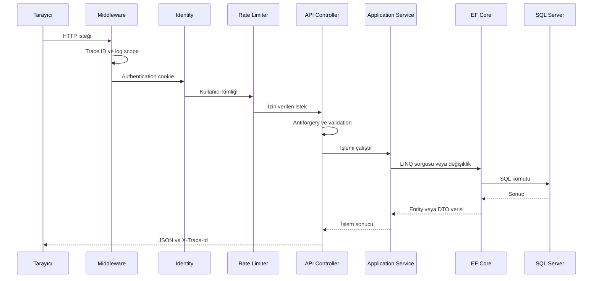

# MiniMola

MiniMola; iş veya günlük hayat sırasında 5–10 dakikalık kısa bir mola vermek isteyen kullanıcılar için geliştirilen, oyunlaştırılmış bir web uygulamasıdır.

Uygulamanın merkezinde her kullanıcıya ait kişisel bir sanal akvaryum bulunur. Kullanıcılar mini oyunları tamamlayarak **Damla** adı verilen puanları kazanır. Kazandıkları Damlalarla yeni balıklar ve dekorasyonlar satın alabilir, akvaryumlarını büyütebilir ve kişiselleştirebilir.

Mini oyunların yanında güncel haberler ve Spotify entegrasyonu da bulunur. Böylece kullanıcı kısa molası sırasında:

- Mini oyun oynayabilir.
- Akvaryumuyla ilgilenebilir.
- Balıklarını besleyebilir.
- Gündeme göz atabilir.
- Kendi Spotify hesabından müzik veya podcast dinleyebilir.

> Projenin mevcut arayüz sürümü: **V2**  
> Mevcut mimari: **Katmanlı Modüler Monolith**  
> Mevcut çalışma ortamı: **Local Development**

---

## İçindekiler

- [Projenin amacı](#projenin-amacı)
- [Temel özellikler](#temel-özellikler)
- [Ekranlar](#ekranlar)
- [Puan sistemi](#puan-sistemi)
- [Akvaryum sistemi](#akvaryum-sistemi)
- [Balık bakım sistemi](#balık-bakım-sistemi)
- [Mini oyunlar](#mini-oyunlar)
- [Spotify entegrasyonu](#spotify-entegrasyonu)
- [Haber sistemi](#haber-sistemi)
- [Kullanılan teknolojiler](#kullanılan-teknolojiler)
- [Teknoloji rehberi](#teknoloji-rehberi)
- [Mimari yapı](#mimari-yapı)
- [İstek yaşam döngüsü](#istek-yaşam-döngüsü)
- [Proje klasörleri](#proje-klasörleri)
- [Veritabanı](#veritabanı)
- [API uçları](#api-uçları)
- [Hata yönetimi](#hata-yönetimi)
- [Loglama ve Trace ID](#loglama-ve-trace-id)
- [Rate limiting](#rate-limiting)
- [Hangfire ve arka plan görevleri](#hangfire-ve-arka-plan-görevleri)
- [Environment ve secret yönetimi](#environment-ve-secret-yönetimi)
- [Kurulum](#kurulum)
- [Spotify ayarları](#spotify-ayarları)
- [Migration işlemleri](#migration-işlemleri)
- [Frontend geliştirme](#frontend-geliştirme)
- [Güvenlik](#güvenlik)
- [Sorun giderme](#sorun-giderme)
- [Bilinen sınırlamalar](#bilinen-sınırlamalar)
- [Gelecek planları](#gelecek-planları)
- [Microservice yaklaşımı](#microservice-yaklaşımı)
- [Proje durumu](#proje-durumu)

---

## Projenin amacı

MiniMola'nın temel amacı, kullanıcının uzun süreli dikkat gerektiren işlerden kısa süreliğine uzaklaşmasını sağlamaktır.

Uygulama şu kullanım senaryosu düşünülerek geliştirilmiştir:

1. Kullanıcı iş sırasında kısa bir mola vermek ister.
2. MiniMola hesabına giriş yapar.
3. Günlük oyunlardan birini oynar.
4. Başarılı olursa Damla kazanır.
5. Damlalarla balık veya dekorasyon satın alır.
6. Balıklarına isim verir ve onları besler.
7. Akvaryumunu zaman içerisinde geliştirir.
8. İsterse gündeme göz atar.
9. Kendi Spotify hesabından müzik veya podcast dinler.

Bu yapı sayesinde oyunlar bağımsız eğlenceler olarak kalmaz. Oyunlardan kazanılan puanlar, akvaryum gelişimini besleyen ortak ilerleme sisteminin parçası olur.

---

## Temel özellikler

### Kullanıcı sistemi

- ASP.NET Core Identity tabanlı üyelik
- Kullanıcı kayıt ve giriş işlemleri
- Cookie tabanlı kimlik doğrulama
- Kullanıcıya özel profil
- Kullanıcıya özel Damla bakiyesi
- Kullanıcıya özel akvaryum
- Kullanıcıya özel balık koleksiyonu
- Kullanıcıya özel dekorasyon koleksiyonu
- Oturum açmış kullanıcılar için korumalı sayfalar
- İlk girişte otomatik profil oluşturma
- İlk kullanıcı profilinde başlangıç hediyesi

> MiniMola şu anda JWT kullanmaz. Web oturumları ASP.NET Core Identity tarafından oluşturulan şifreli authentication cookie ile yönetilir.

### Akvaryum

- PixiJS ile hazırlanmış etkileşimli sanal akvaryum
- Hareket eden balıklar
- Balık türüne göre farklı hız ve boyut değerleri
- Kullanıcıya özel balık koleksiyonu
- Balıklara isim verme ve isim değiştirme
- Balık detay penceresi
- Balık mutluluk ve beslenme sistemi
- Satın alınan dekorasyonların akvaryumda gösterilmesi
- Dekorasyonları sürükleyerek konumlandırma
- Dekorasyon konumlarının veritabanında saklanması
- Akvaryum seviyesi ve kapasite sistemi
- Damla harcayarak akvaryum yükseltme

### Mini oyunlar

- Günün Kelimesi
- Baloncuk Patlat
- Hafıza Kartları
- Günlük ödül kontrolü
- Aynı ödülün tekrar verilmesini engelleyen iş kuralları
- Türkiye saat dilimine göre günlük oyun takibi
- Sunucu tarafında skor ve ödül doğrulaması
- Günlük kelime havuzu
- Hangfire ile günlük kelime hazırlama görevi

### Mağaza

- Balık mağazası
- Dekorasyon mağazası
- Kullanıcı bakiyesine göre satın alma kontrolü
- Akvaryum seviyesine göre ürün kilidi
- Balık kapasitesi kontrolü
- Satın alınan ürün sayısını gösterme
- Başarılı satın alma sonrasında anlık bakiye güncelleme
- Satın alma işlemlerinde sunucu tarafı doğrulaması

### Haberler

- Habertürk RSS akışından güncel manşetler
- Haber başlığı, özeti ve yayın zamanı
- Haberleri kaynak sayfasında açma
- Beş dakikalık bellek önbelleği
- Güvenli RSS ve XML işleme
- Dış servis zaman aşımı kontrolü

### Spotify

- Kullanıcının kendi Spotify hesabını bağlaması
- OAuth 2.0 ve PKCE tabanlı yetkilendirme
- Çalan içeriği görüntüleme
- Şarkı ve sanatçı arama
- Kullanıcının çalma listelerini görüntüleme
- Şarkı veya çalma listesi oynatma
- Önceki, oynat/duraklat ve sonraki kontrolleri
- Ses seviyesi kontrolü
- Spotify bağlantısını kaldırma
- Süresi dolan access token'ı refresh token ile yenileme
- Token değerlerini korumalı biçimde saklama

### Teknik altyapı

- Katmanlı modüler monolith mimari
- Entity Framework Core Code First
- FluentValidation
- Global API hata yönetimi
- RFC uyumlu Problem Details cevapları
- Kullanıcı bazlı rate limiting
- Structured logging
- Request Trace ID
- Hangfire arka plan görevleri
- SQL Server tabanlı Hangfire storage
- Environment bazlı yapılandırma
- ASP.NET Core User Secrets
- Dependency Injection
- HttpClient Factory
- Memory Cache

### Arayüz

- Responsive V2 tasarım
- Masaüstü ve mobil uyumlu menü
- Ortak renk ve tasarım sistemi
- SVG tabanlı ikonlar
- Oyun, akvaryum, mağaza, haber ve müzik sayfalarında ortak görünüm
- Mobil ekranlar için taşma ve yerleşim düzenlemeleri
- `prefers-reduced-motion` desteği
- Erişilebilir buton ve durum mesajları

---

## Ekranlar

| Sayfa | Adres | Açıklama |
|---|---|---|
| Ana sayfa | `/` | MiniMola özelliklerini ve kullanıcı ilerlemesini gösterir |
| Akvaryum | `/Aquarium` | Balıkları, dekorasyonları ve bakım özelliklerini gösterir |
| Balık mağazası | `/Shop` | Satın alınabilecek balıkları listeler |
| Dekorasyon mağazası | `/Shop/Decorations` | Akvaryum dekorasyonlarını listeler |
| Günün Kelimesi | `/Games/Word` | Günlük beş harfli kelime oyunu |
| Baloncuk Patlat | `/Games/Bubble` | Süreli refleks oyunu |
| Hafıza Kartları | `/Games/Memory` | Kart eşleştirme oyunu |
| Gündem | `/News` | Habertürk RSS manşetlerini gösterir |
| Müzik | `/Music` | Spotify bağlantısı, arama, listeler ve oynatıcı |
| Hangfire Dashboard | `/hangfire` | Development ortamındaki arka plan görevlerini gösterir |
| Gizlilik | `/Home/Privacy` | Uygulamanın gizlilik açıklamalarını gösterir |
| Giriş | `/Identity/Account/Login` | Identity giriş ekranı |
| Kayıt | `/Identity/Account/Register` | Identity üyelik ekranı |

Hangfire Dashboard yalnızca Development ortamında etkinleştirilmiştir.

---

## Puan sistemi

MiniMola içerisindeki puan biriminin adı **Damla**dır.

Kullanıcılar oyunları tamamlayarak Damla kazanır. Kazanılan Damlalar:

- Balık satın almak
- Dekorasyon satın almak
- Akvaryumu yükseltmek

için kullanılır.

Her puan hareketi `PointTransactions` tablosuna kaydedilir. Böylece puanın hangi işlem sonucunda kazanıldığı veya harcandığı takip edilebilir.

### Başlangıç hediyesi

Yeni kullanıcı profili oluşturulduğunda otomatik olarak:

- 250 Damla
- Seviye 1 akvaryum
- 5 balık kapasitesi
- Bir adet Mavi Tang
- Başlangıç balığının adı olarak Maviş

verilir.

### Oyun ödülleri

| Oyun | Şart | Günlük ödül |
|---|---|---:|
| Günün Kelimesi | Kelimeyi en fazla 6 tahminde bulmak | 30 Damla |
| Baloncuk Patlat | 45 saniyede en az 25 baloncuk patlatmak | 40 Damla |
| Hafıza Kartları | 6 kart çiftinin tamamını bulmak | 60 Damla |

Bir oyunun günlük ödülü aynı kullanıcıya aynı gün içerisinde yalnızca bir kez verilir.

Baloncuk ve hafıza oyunlarının günlük ödül kontrolü `PointTransactions.ReferenceId` alanı üzerinden yapılır.

Örnek referans değerleri:

```text
bubble-game-2026-08-24
memory-game-2026-08-24
word-game-12
```

---

## Akvaryum sistemi

Her kullanıcı profiline bağlı bir akvaryum bulunur.

Akvaryum şu temel bilgilere sahiptir:

- Ad
- Tema anahtarı
- Seviye
- Balık kapasitesi
- Kullanıcı balıkları
- Yerleştirilmiş dekorasyonlar

### Akvaryum seviyeleri

Akvaryum en fazla 5. seviyeye yükseltilebilir.

| Mevcut seviye | Yeni seviye | Yeni kapasite | Yükseltme bedeli |
|---:|---:|---:|---:|
| 1 | 2 | 8 | 300 Damla |
| 2 | 3 | 12 | 700 Damla |
| 3 | 4 | 17 | 1.300 Damla |
| 4 | 5 | 23 | 2.200 Damla |

Yükseltme işlemi sırasında:

1. Kullanıcı bakiyesi kontrol edilir.
2. İşlem serializable veritabanı transaction'ı içerisinde yürütülür.
3. Yükseltme bedeli bakiyeden düşülür.
4. Akvaryum seviyesi ve kapasitesi artırılır.
5. Harcama puan işlem geçmişine kaydedilir.
6. İşlem yapılandırılmış log ile kayıt altına alınır.

### Balık türleri

| Balık | Nadirlik | Fiyat | Gerekli seviye |
|---|---|---:|---:|
| Mavi Tang | Common | Başlangıç balığı | 1 |
| Palyaço Balığı | Common | 200 Damla | 1 |
| Neon Tetra | Uncommon | 450 Damla | 1 |
| Beta Balığı | Rare | 800 Damla | 2 |
| Altın Balık | Rare | 1.200 Damla | 2 |

Her balık türünün kendine ait:

- `AssetKey`
- Hareket hızı
- Görüntü ölçeği
- Nadirlik seviyesi
- Minimum akvaryum seviyesi

değerleri bulunur.

### Dekorasyonlar

| Dekorasyon | Kategori | Fiyat | Gerekli seviye |
|---|---|---:|---:|
| Kıvrımlı Su Bitkisi | Plant | 100 Damla | 1 |
| Volkan Taşı | Rock | 140 Damla | 1 |
| Pembe Mercan | Coral | 160 Damla | 1 |
| Hazine Sandığı | Ornament | 260 Damla | 1 |
| Mini Deniz Feneri | Structure | 500 Damla | 2 |
| Ay Işığı Lambası | Lighting | 750 Damla | 3 |

Kullanıcı dekorasyon satın aldığında ürün akvaryuma yerleştirilir. Dekorasyon sürüklendiğinde normalize edilmiş X ve Y koordinatları API üzerinden veritabanına kaydedilir.

---

## Balık bakım sistemi

Kullanıcı akvaryumdaki bir balığa tıklayarak balık detay penceresini açabilir.

Detay penceresinde:

- Balığın adı
- Balık türü
- Nadirlik
- Akvaryuma katılma tarihi
- Mutluluk oranı
- Bakım durumu
- Toplam beslenme sayısı
- Yeniden beslenebileceği zaman

görüntülenir.

### Balık isimlendirme

Kullanıcı balığına yeni bir isim verebilir.

İsim kuralları:

- Boş bırakılamaz.
- En fazla 20 karakter olabilir.
- Harf, rakam, boşluk, tire ve kesme işareti kullanılabilir.
- Doğrulama FluentValidation ile sunucu tarafında yapılır.

### Beslenme ve mutluluk

Balık bakım sistemi şu kurallarla çalışır:

- Hiç beslenmemiş balık yüzde 35 mutlulukla başlar.
- Balık beslendiğinde mutluluk yüzde 100 olur.
- Mutluluk her 6 saatte 10 puan azalır.
- Mutluluk en az yüzde 20 seviyesinde kalır.
- Aynı balık 4 saat dolmadan yeniden beslenemez.
- Besleme ücretsizdir.
- Beslenme bilgisi SQL Server'da saklanır.
- Sayfa yenilendiğinde bakım durumu korunur.

`UserFish` tablosunda bakım için kullanılan alanlar:

```text
LastFedAtUtc
TotalFeedings
```

Mutluluk değeri doğrudan veritabanında tutulmaz. `LastFedAtUtc` değerine göre API isteği sırasında hesaplanır. Böylece zaman geçtikçe mutluluk değeri doğal olarak değişir ve ayrıca periyodik olarak her balığı güncellemek gerekmez.

---

## Mini oyunlar

### Günün Kelimesi

Wordle benzeri günlük bir kelime oyunudur.

Kurallar:

- Kelimeler 5 harflidir.
- Kullanıcının en fazla 6 tahmin hakkı vardır.
- Türkçe karakterler desteklenir.
- Aynı kelime ikinci kez tahmin edilemez.
- Harf sonuçları üç durumla değerlendirilir:
  - `0`: Kelimede yok
  - `1`: Kelimede var ancak yanlış konumda
  - `2`: Doğru konumda
- Başarılı kullanıcı 30 Damla kazanır.
- Oyun tamamlanana kadar doğru cevap API tarafından açıklanmaz.

Kelimeler `WordPoolItems` tablosundaki aktif kelime havuzundan seçilir. Eksik bir günlük bulmaca gerektiğinde sistem, daha önce en eski tarihte kullanılmış aktif kelimeyi seçerek yeni bir `DailyWordPuzzle` oluşturur.

Hangfire recurring job'u her gece yerel saatle `00:05`'te bugünün bulmacasının hazır olduğundan emin olur.

### Baloncuk Patlat

Kısa süreli bir refleks oyunudur.

- Süre: 45 saniye
- Hedef: 25 baloncuk
- Ödül: 40 Damla
- Günlük ödül: Bir kez

Oyun tarayıcıda çalışır. Son skor API'ye gönderilir ve ödül şartları sunucu tarafında tekrar kontrol edilir.

### Hafıza Kartları

Deniz canlıları temalı kart eşleştirme oyunudur.

- 6 kart çifti
- Toplam 12 kart
- Ödül: 60 Damla
- Günlük ödül: Bir kez
- Tamamlama ve hamle sayısı sunucu tarafında doğrulanır

---

## Spotify entegrasyonu

Spotify bağlantısı MiniMola Identity hesabından bağımsızdır. Her kullanıcı kendi Spotify hesabını bağlar ve kendi müziklerine erişir.

MiniMola kullanıcının Spotify şifresini görmez veya saklamaz. Yetkilendirme Spotify'ın OAuth ekranı üzerinden gerçekleştirilir.

### Kimlik doğrulama akışı

1. Kullanıcı MiniMola'da Spotify bağlantısını başlatır.
2. Kullanıcı Spotify yetkilendirme ekranına yönlendirilir.
3. Spotify kullanıcıdan izin ister.
4. Spotify MiniMola callback adresine authorization code gönderir.
5. MiniMola bu kodu access token ve refresh token ile değiştirir.
6. Token değerleri ASP.NET Core Data Protection ile korunarak saklanır.
7. Access token süresi dolduğunda refresh token ile yenilenir.

### İstenen Spotify izinleri

```text
user-read-private
user-read-email
streaming
user-read-playback-state
user-read-currently-playing
user-modify-playback-state
playlist-read-private
user-read-playback-position
```

### Spotify özellikleri

- Access token alma
- Refresh token ile access token yenileme
- Kullanıcı bağlantı durumunu görüntüleme
- Çalan şarkı veya podcast bilgisini alma
- Şarkı ve sanatçı arama
- İlk 20 çalma listesini getirme
- Web Playback SDK ile oynatma
- Oynatmayı MiniMola tarayıcı oynatıcısına aktarma
- Spotify bağlantısını kaldırma

Spotify Web Playback özelliklerinin tamamı için Spotify hesabının uygun oynatma yetkisine sahip olması gerekebilir.

---

## Haber sistemi

Gündem sayfası Habertürk RSS akışını kullanır.

Kullanılan RSS adresi:

```text
https://www.haberturk.com/rss/manset.xml
```

Haber servisi:

- RSS içeriğini `HttpClient` ile alır.
- En fazla 10 haber döndürür.
- HTML etiketlerini haber özetlerinden temizler.
- Yalnızca beklenen alan adına ait güvenli bağlantıları kabul eder.
- DTD işlemeyi kapatarak XML güvenliğini artırır.
- Sonuçları 5 dakika boyunca memory cache içerisinde saklar.
- Haber başlığı ve özet uzunluklarını sınırlar.
- Her haber için URL üzerinden kararlı bir kimlik üretir.
- Dış servis çağrısında zaman aşımı uygular.

MiniMola yalnızca haber başlığı ve kısa özetini gösterir. Haberin tamamı kaynak sitede açılır.

---

## Kullanılan teknolojiler

### Backend

- .NET 10
- C#
- ASP.NET Core MVC
- ASP.NET Core Web API
- ASP.NET Core Identity
- Entity Framework Core 10.0.10
- Microsoft SQL Server
- SQL Server Express
- ASP.NET Core Data Protection
- OAuth 2.0
- PKCE
- FluentValidation 12.1.1
- ASP.NET Core Rate Limiting
- ASP.NET Core Problem Details
- `IExceptionHandler`
- Structured Logging
- HttpClient Factory
- Memory Cache
- Hangfire 1.8.24
- Hangfire SQL Server

### Frontend

- Razor Views
- HTML5
- CSS3
- JavaScript
- Bootstrap
- PixiJS 8
- Spotify Web Playback SDK
- esbuild
- Responsive tasarım
- SVG ikonlar

### Geliştirme ortamı

- Visual Studio
- SQL Server Management Studio
- Node.js
- npm
- PowerShell
- Postman
- Windows Authentication
- Git ve GitHub

---

## Teknoloji rehberi

Bu bölüm, kullanılan teknolojilerin yalnızca isimlerini değil projede neden ve nerede kullanıldıklarını açıklar.

### .NET 10

MiniMola projelerinin hedef framework değeri:

```xml
<TargetFramework>net10.0</TargetFramework>
```

.NET uygulamanın çalışma zamanı, standart kütüphaneleri, Dependency Injection altyapısı, configuration sistemi, logging sistemi ve web sunucusu için temel platformu sağlar.

### ASP.NET Core MVC

MVC, sunucuda HTML sayfaları oluşturmak için kullanılır.

Projede MVC tarafı:

- Controller
- Razor View
- ViewModel
- Layout
- Partial View

bileşenlerinden oluşur.

Örnek MVC sayfaları:

```text
/Aquarium
/Shop
/Games/Word
/News
/Music
```

MVC sayfaları kullanıcıya HTML döndürür.

### ASP.NET Core Web API

Web API, JavaScript uygulamaları ile backend arasındaki veri iletişimini sağlar.

API cevapları JSON biçimindedir.

Örnek:

```text
GET /api/aquarium
POST /api/aquarium/fish/1/feed
PUT /api/aquarium/fish/1/nickname
```

Frontend, `fetch` API kullanarak bu endpoint'lere istek gönderir.

### ASP.NET Core Identity

Identity şu işlemleri yönetir:

- Kullanıcı kaydı
- Kullanıcı girişi
- Şifre hashleme
- Authentication cookie oluşturma
- Kullanıcının oturum durumunu belirleme
- `[Authorize]` kullanılan sayfaları koruma

MiniMola şu anda JWT yerine cookie authentication kullanır.

Tarayıcı giriş yaptıktan sonra şu isimde şifreli bir cookie oluşturulur:

```text
.AspNetCore.Identity.Application
```

Bu cookie parola değildir ancak aktif oturumu temsil ettiği için paylaşılmamalıdır.

### Entity Framework Core

Entity Framework Core, C# entity sınıfları ile SQL Server tabloları arasındaki bağlantıyı sağlar.

Projede EF Core şu amaçlarla kullanılır:

- LINQ sorguları
- Entity takibi
- İlişkiler
- Transaction yönetimi
- Migration
- Seed data
- SQL Server provider
- AsNoTracking sorguları

Örnek akış:

```text
C# Entity
    ↓
Entity Configuration
    ↓
Migration
    ↓
SQL Server Tablosu
```

### SQL Server

MiniMola'nın kalıcı verileri SQL Server'da tutulur.

Geliştirme sunucusu:

```text
localhost\SQLEXPRESS
```

Veritabanı:

```text
MiniMolaDb
```

Bağlantıda Windows Authentication kullanılır.

### Dependency Injection

Servisler doğrudan `new` ile oluşturulmaz. ASP.NET Core Dependency Injection container içerisine kaydedilir.

Örnek:

```csharp
services.AddScoped<IAquariumService, AquariumService>();
```

Controller yalnızca arayüzü bilir:

```csharp
public sealed class AquariumApiController(
    IAquariumService aquariumService)
```

Bu yaklaşım:

- Bağımlılıkları görünür hale getirir.
- Katmanlar arasındaki bağı azaltır.
- Test yazmayı kolaylaştırır.
- Servis implementasyonlarının değiştirilebilmesini sağlar.

### FluentValidation

FluentValidation, request modellerinin doğrulanması için kullanılır.

Balık adı doğrulaması örneğinde:

- Boş değer kontrolü
- Maksimum uzunluk
- İzin verilen karakterler

validator sınıfı içerisinde tanımlanır.

Bu sayede doğrulama kuralları controller içerisinde dağılmaz.

Konum:

```text
MiniMola.Application/Aquariums/Validators
```

### Problem Details ve global hata yönetimi

API hataları ortak bir JSON formatına dönüştürülür.

Global handler:

```text
MiniMola.Web/ErrorHandling/GlobalExceptionHandler.cs
```

Handler, `IExceptionHandler` arayüzünü uygular.

Örnek hata cevabı:

```json
{
  "type": "https://tools.ietf.org/html/rfc9110#section-15.5.10",
  "title": "İşlem gerçekleştirilemedi",
  "status": 409,
  "detail": "İşlem gerçekleştirilemedi.",
  "instance": "/api/example",
  "traceId": "00-..."
}
```

MVC sayfaları kullanıcı dostu hata sayfasını kullanırken `/api` istekleri JSON Problem Details döndürür.

### Structured logging

String birleştirilerek düz metin loglamak yerine alan isimleriyle yapılandırılmış loglama kullanılır.

Örnek:

```csharp
logger.LogInformation(
    "Balık beslendi. UserFishId: {UserFishId}, TotalFeedings: {TotalFeedings}",
    userFish.Id,
    userFish.TotalFeedings);
```

`UserFishId` ve `TotalFeedings` ayrı log alanlarıdır. İleride Seq, Elasticsearch veya OpenTelemetry kullanıldığında bu alanlar üzerinden sorgulama yapılabilir.

Teknik loglar şu anda konsola yazılır. Teknik loglar henüz uygulama veritabanına kaydedilmez.

İş açısından önemli Damla hareketleri ise `PointTransactions` tablosunda kalıcı olarak tutulur.

### Request Trace ID

Her HTTP isteğine takip kimliği eklenir.

Middleware:

```text
MiniMola.Web/Middleware/RequestLogScopeMiddleware.cs
```

Response header:

```text
X-Trace-Id
```

Bir kullanıcı hata bildirdiğinde bu değer log kayıtlarıyla eşleştirilebilir.

### Rate limiting

Rate limiting, bir kullanıcının kısa sürede çok fazla yazma isteği göndermesini engeller.

MiniMola'da sabit pencere algoritması kullanılır.

Politikalar:

| Politika | Sınır | Süre |
|---|---:|---:|
| Aquarium write | 10 istek | 1 dakika |
| Game submit | 30 istek | 1 dakika |

Sayaç oturum açmış kullanıcılar için Identity kullanıcı kimliği üzerinden tutulur. Kullanıcı yoksa IP adresi kullanılır.

Sınır aşılırsa:

```text
HTTP 429 Too Many Requests
```

döndürülür.

Dekorasyon sürükleme işlemi kullanıcı deneyimini bozmamak için akvaryum yazma politikasına dahil edilmemiştir.

### Hangfire

Hangfire, uygulama açıkken arka planda güvenilir görevler çalıştırmak için kullanılır.

MiniMola'da:

- İki worker çalışır.
- Görevler SQL Server'da saklanır.
- Uygulama yeniden başladığında görev bilgileri kaybolmaz.
- Başarılı ve hatalı görevler dashboard'dan izlenebilir.
- Tekrarlanan görevler cron ifadesiyle planlanır.

Mevcut recurring job:

```text
prepare-daily-word-puzzle
```

Cron:

```text
5 0 * * *
```

Bu ifade yerel saatle her gün `00:05` anlamına gelir.

### HttpClient Factory

Spotify ve Habertürk gibi dış servis çağrıları `HttpClientFactory` ile yapılır.

Avantajları:

- HttpClient yaşam döngüsünü yönetir.
- Socket tükenmesi riskini azaltır.
- BaseAddress ve timeout merkezi olarak ayarlanabilir.
- İleride retry ve circuit breaker politikaları eklenebilir.

### Memory Cache

Habertürk RSS sonucu beş dakika boyunca bellekte tutulur.

Bu sayede:

- Her kullanıcı isteğinde RSS kaynağına gidilmez.
- Dış servisin yükü azalır.
- Gündem sayfası daha hızlı açılır.

Memory cache uygulama yeniden başlatıldığında temizlenir ve birden fazla sunucu arasında paylaşılmaz.

### Data Protection

Spotify access token ve refresh token değerleri veritabanına düz metin olarak yazılmaz.

ASP.NET Core Data Protection kullanılarak token değerleri korunur.

Data Protection:

- Veriyi şifreler.
- Uygulama dışından okunmasını zorlaştırır.
- Token saklama riskini azaltır.

### OAuth 2.0 ve PKCE

Spotify entegrasyonu OAuth 2.0 authorization code akışını kullanır.

PKCE, authorization code'un ele geçirilmesi durumunda başka bir istemci tarafından kullanılmasını zorlaştırır.

### Razor Views

Razor, HTML ile C# ifadelerinin birlikte kullanılmasını sağlar.

Örnek:

```cshtml
@if (User.Identity?.IsAuthenticated == true)
{
    <a asp-controller="Aquarium"
       asp-action="Index">
        Akvaryumum
    </a>
}
```

### PixiJS

PixiJS akvaryum sahnesini çizmek ve hareket ettirmek için kullanılır.

PixiJS tarafında:

- Balık gövdeleri
- Balık hareketleri
- Dekorasyonlar
- Baloncuklar
- Akvaryum çevresi
- Pointer etkileşimleri
- Animasyon döngüsü

yönetilir.

PixiJS yalnızca akvaryum bundle'ına dahil edilir.

### esbuild

Kaynak JavaScript dosyaları esbuild ile bundle edilir ve küçültülür.

Kaynak:

```text
MiniMola.Web/ClientApp
```

Çıktı:

```text
MiniMola.Web/wwwroot/js
```

`wwwroot/js` içerisindeki bundle dosyaları doğrudan düzenlenmemelidir.

### Neden AutoMapper kullanılmıyor?

Projede DTO eşlemeleri şu anda açık şekilde servis metotlarında yapılmaktadır.

Bu aşamada:

- Eşleme sayısı yönetilebilir durumda.
- İş kuralları eşleme sırasında hesaplanabiliyor.
- Açık eşleme kodun nasıl çalıştığını öğrenmeyi kolaylaştırıyor.

DTO sayısı ve tekrar eden eşlemeler ciddi şekilde artarsa AutoMapper tekrar değerlendirilebilir.

### Neden Smidge kullanılmıyor?

JavaScript paketleme ve küçültme işlemi zaten esbuild ile yapılmaktadır.

Aynı sorumluluk için ikinci bir asset pipeline eklemek:

- Yapılandırmayı karmaşıklaştırır.
- Build sürecini ikiye böler.
- Hangi aracın hangi dosyayı yönettiğini belirsizleştirir.

Bu nedenle frontend asset pipeline için esbuild kullanılmaya devam edilir.

---

## Mimari yapı

MiniMola katmanlı, modüler monolith yapısında geliştirilmiştir.



### MiniMola.Domain

Sistemin temel iş modellerini içerir.

Bu katmanda:

- Entity sınıfları
- Enum değerleri
- Ortak temel entity sınıfı

bulunur.

Domain katmanı diğer proje katmanlarına bağımlı değildir.

### MiniMola.Application

Uygulamanın servis sözleşmelerini ve veri taşıma modellerini içerir.

Bu katmanda:

- Servis arayüzleri
- Request modelleri
- Response DTO'ları
- Validator sınıfları
- Uygulamaya özel exception sınıfları
- Uygulama soyutlamaları

bulunur.

Application katmanı Infrastructure implementasyonlarını bilmez.

### MiniMola.Infrastructure

Veritabanı ve dış servis işlemlerini gerçekleştirir.

Bu katmanda:

- `ApplicationDbContext`
- Entity Framework configuration sınıfları
- Migration dosyaları
- Seed verileri
- Servis implementasyonları
- SQL Server bağlantısı
- Spotify servis işlemleri
- Habertürk RSS servisi
- Dependency Injection kayıtları

bulunur.

### MiniMola.Web

Kullanıcı arayüzü ve HTTP giriş noktasıdır.

Bu katmanda:

- MVC Controller'ları
- API Controller'ları
- Razor View'ları
- Identity yapılandırması
- Spotify OAuth yapılandırması
- Global hata yönetimi
- Rate limiting
- Middleware
- Hangfire yapılandırması
- CSS dosyaları
- JavaScript uygulamaları
- PixiJS akvaryumu

bulunur.

---

## İstek yaşam döngüsü

Bir akvaryum API isteği genel olarak şu akıştan geçer:



Beklenmeyen bir exception oluşursa `GlobalExceptionHandler` devreye girer ve API için Problem Details cevabı üretir.

---

## Proje klasörleri

```text
MiniMola
│
├── MiniMola.Domain
│   ├── Common
│   ├── Entities
│   └── Enums
│
├── MiniMola.Application
│   ├── Abstractions
│   ├── Aquariums
│   │   └── Validators
│   ├── BubbleGames
│   ├── Common
│   │   └── Exceptions
│   ├── MemoryGames
│   ├── News
│   ├── Shop
│   ├── Spotify
│   └── WordGames
│
├── MiniMola.Infrastructure
│   ├── Persistence
│   │   ├── Configurations
│   │   ├── Migrations
│   │   └── Seed
│   ├── Services
│   ├── Spotify
│   └── DependencyInjection.cs
│
├── MiniMola.Web
│   ├── Areas
│   ├── ClientApp
│   ├── Controllers
│   │   └── Api
│   ├── ErrorHandling
│   ├── Middleware
│   ├── Models
│   ├── Properties
│   ├── RateLimiting
│   ├── Views
│   ├── wwwroot
│   │   ├── css
│   │   ├── js
│   │   └── lib
│   ├── Program.cs
│   ├── appsettings.json
│   ├── appsettings.Development.json
│   ├── appsettings.Production.json
│   └── package.json
│
└── MiniMola.slnx
```

---

## Veritabanı

MiniMola, Microsoft SQL Server ve Entity Framework Core Code First yaklaşımını kullanır.

### Temel tablolar

| Tablo | Açıklama |
|---|---|
| `AspNetUsers` | Identity kullanıcıları |
| `UserProfiles` | MiniMola profilleri ve Damla bakiyesi |
| `Aquariums` | Kullanıcı akvaryumları |
| `FishSpecies` | Satın alınabilir balık türleri |
| `UserFish` | Kullanıcı balıkları ve bakım bilgileri |
| `DecorationItems` | Mağazadaki dekorasyon tanımları |
| `UserDecorations` | Satın alınan ve yerleştirilen dekorasyonlar |
| `PointTransactions` | Kazanılan ve harcanan Damla hareketleri |
| `WordPoolItems` | Aktif günlük kelime havuzu |
| `DailyWordPuzzles` | Tarihe atanmış günlük kelimeler |
| `WordGameSessions` | Kullanıcı kelime oyunu oturumları |
| `WordGameGuesses` | Kelime tahminleri ve sonuçları |
| `SpotifyConnections` | Kullanıcılara ait Spotify bağlantıları |

Identity tarafından kullanılan rol, claim, login ve token tabloları da veritabanında bulunur.

### Hangfire tabloları

Hangfire ilk çalıştırmada `HangFire` şeması altında kendi tablolarını otomatik oluşturur.

Bu tablolarda:

- Job tanımları
- Job durumları
- Recurring job bilgileri
- Başarılı ve hatalı çalışma kayıtları
- Worker/server bilgileri
- Kuyruk bilgileri

saklanır.

Hangfire tabloları için EF Core migration oluşturulmaz. Tablolar Hangfire tarafından yönetilir.

### Bağlantı

Geliştirme bağlantısı:

```json
{
  "ConnectionStrings": {
    "DefaultConnection": "Server=localhost\\SQLEXPRESS;Database=MiniMolaDb;Trusted_Connection=True;MultipleActiveResultSets=true;TrustServerCertificate=True"
  }
}
```

Bu bağlantı Windows Authentication kullanır.

---

## API uçları

Uygulama API'leri oturum açmış kullanıcılar için korunmaktadır.

### Akvaryum

| Metot | Adres | Açıklama |
|---|---|---|
| GET | `/api/aquarium` | Kullanıcının akvaryumunu getirir |
| GET | `/api/aquarium/upgrade` | Yükseltme durumunu getirir |
| POST | `/api/aquarium/upgrade` | Akvaryumu yükseltir |
| PUT | `/api/aquarium/decorations/{id}/position` | Dekorasyon konumunu kaydeder |
| POST | `/api/aquarium/fish/{id}/feed` | Seçilen balığı besler |
| PUT | `/api/aquarium/fish/{id}/nickname` | Balığın adını değiştirir |

### Balık mağazası

| Metot | Adres | Açıklama |
|---|---|---|
| GET | `/api/shop/fish` | Balık mağazasını getirir |
| POST | `/api/shop/fish/{fishSpeciesId}` | Balık satın alır |

### Dekorasyon mağazası

| Metot | Adres | Açıklama |
|---|---|---|
| GET | `/api/shop/decorations` | Dekorasyon mağazasını getirir |
| POST | `/api/shop/decorations/{decorationItemId}` | Dekorasyon satın alır |

### Günün Kelimesi

| Metot | Adres | Açıklama |
|---|---|---|
| GET | `/api/games/word` | Günlük oyunun durumunu getirir |
| POST | `/api/games/word/guess` | Yeni kelime tahmini gönderir |

### Baloncuk Patlat

| Metot | Adres | Açıklama |
|---|---|---|
| GET | `/api/games/bubble` | Günlük oyun ve ödül durumunu getirir |
| POST | `/api/games/bubble/complete` | Oyun skorunu tamamlar |

### Hafıza Kartları

| Metot | Adres | Açıklama |
|---|---|---|
| GET | `/api/games/memory` | Günlük oyun ve ödül durumunu getirir |
| POST | `/api/games/memory/complete` | Eşleşme ve hamle sonucunu gönderir |

### Haberler

| Metot | Adres | Açıklama |
|---|---|---|
| GET | `/api/news/headlines` | Güncel haber başlıklarını getirir |

### Spotify

| Metot | Adres | Açıklama |
|---|---|---|
| GET | `/api/spotify/token` | Geçerli Spotify access token döndürür |
| GET | `/api/spotify/search?query=...` | Spotify üzerinde şarkı arar |
| GET | `/api/spotify/playlists` | Kullanıcının çalma listelerini getirir |

Yazma işlemlerinde antiforgery doğrulaması kullanılır. JavaScript token değerini `X-CSRF-TOKEN` başlığıyla gönderir.

---

## Hata yönetimi

MiniMola kontrollü ve beklenmeyen API hatalarını ortak bir formatta döndürür.

Exception eşlemeleri:

| Exception | HTTP durumu |
|---|---:|
| `NotFoundException` | 404 |
| `ArgumentException` | 400 |
| `UnauthorizedAccessException` | 403 |
| `ConflictException` | 409 |
| `ExternalServiceException` | 503 |
| `HttpRequestException` | 503 |
| `TaskCanceledException` | 504 |
| Beklenmeyen exception | 500 |

Production ortamında 500 seviyesindeki exception ayrıntıları kullanıcıya gösterilmez.

Development ortamında hata türü teşhis amacıyla response içerisine eklenebilir.

---

## Loglama ve Trace ID

Her istekte bir Trace ID oluşturulur veya mevcut activity üzerinden alınır.

Trace ID:

- Log scope içerisine eklenir.
- Response'a `X-Trace-Id` header'ı olarak yazılır.
- Problem Details cevabına eklenir.
- Hata ile log kaydı arasında bağlantı kurulmasını sağlar.

Örnek response header:

```text
X-Trace-Id: 00-abcd...
```

Mevcut log hedefi konsoldur.

Gelecekte değerlendirilebilecek hedefler:

- Serilog
- Seq
- OpenTelemetry
- Grafana Loki
- Elasticsearch

---

## Rate limiting

Rate limiting yalnızca ilgili hassas yazma işlemlerine uygulanır.

### Aquarium write

```text
Politika: aquarium-write
Limit: 10 istek
Pencere: 1 dakika
```

Uygulandığı işlemler:

- Akvaryum yükseltme
- Balık adı değiştirme
- Balık besleme

### Game submit

```text
Politika: game-submit
Limit: 30 istek
Pencere: 1 dakika
```

Uygulandığı işlemler:

- Kelime tahmini gönderme
- Baloncuk oyunu tamamlama
- Hafıza oyunu tamamlama

Sınır aşılırsa JSON Problem Details ile `429 Too Many Requests` döndürülür.

---

## Hangfire ve arka plan görevleri

Hangfire, SQL Server storage ile yapılandırılmıştır.

### Yapılandırma

- Storage: MiniMolaDb
- Worker sayısı: 2
- Server adı: `MiniMola-{MachineName}`
- SQL schema otomatik hazırlanır
- Job bilgileri uygulama yeniden başlatıldığında korunur

### Dashboard

Development ortamında:

```text
http://127.0.0.1:5173/hangfire
```

Dashboard üzerinden:

- Job listesi
- Recurring job listesi
- Başarılı görevler
- Hatalı görevler
- Retry bilgileri
- Aktif server bilgileri

görülebilir.

### Günlük kelime görevi

Job kimliği:

```text
prepare-daily-word-puzzle
```

Cron:

```text
5 0 * * *
```

Görev her gece yerel saatle `00:05`'te çalışır ve bugünün aktif kelime bulmacasının oluşturulduğundan emin olur.

---

## Environment ve secret yönetimi

MiniMola farklı ortamlar için ayrı configuration dosyaları kullanır.

### appsettings.json

Ortak ve hassas olmayan ayarlar bulunur.

### appsettings.Development.json

Development ortamına ait:

- SQL Server bağlantısı
- Ayrıntılı console logging
- Development davranışları

bulunur.

### appsettings.Production.json

Production ortamında:

- Daha sınırlı log seviyesi
- Güvenli hata davranışı
- Production ayarları

için kullanılır.

### User Secrets

Spotify Client ID ve Client Secret kaynak kod içerisinde tutulmaz.

Kullanılan secret anahtarları:

```text
Spotify:ClientId
Spotify:ClientSecret
```

Secret değerleri:

- GitHub'a gönderilmemelidir.
- README içerisine yazılmamalıdır.
- Ekran görüntülerinde paylaşılmamalıdır.
- `appsettings.json` içerisine eklenmemelidir.

---

## Kurulum

### Gereksinimler

- .NET 10 SDK
- Visual Studio
- ASP.NET and web development workload
- SQL Server Express
- SQL Server Management Studio
- Node.js
- npm
- Spotify entegrasyonu için Spotify Developer hesabı

### 1. Repoyu klonlayın

```powershell
git clone REPOSITORY_URL
Set-Location .\MiniMola
```

### 2. SDK sürümünü kontrol edin

```powershell
dotnet --version
dotnet --list-sdks
```

### 3. SQL Server bağlantısını ayarlayın

`MiniMola.Web/appsettings.Development.json` içerisinde:

```json
{
  "ConnectionStrings": {
    "DefaultConnection": "Server=localhost\\SQLEXPRESS;Database=MiniMolaDb;Trusted_Connection=True;MultipleActiveResultSets=true;TrustServerCertificate=True"
  }
}
```

### 4. Spotify secret değerlerini tanımlayın

```powershell
dotnet user-secrets set "Spotify:ClientId" "CLIENT_ID" `
  --project .\MiniMola.Web

dotnet user-secrets set "Spotify:ClientSecret" "CLIENT_SECRET" `
  --project .\MiniMola.Web
```

### 5. NuGet paketlerini yükleyin

```powershell
dotnet restore .\MiniMola.slnx
```

### 6. Frontend paketlerini yükleyin

```powershell
Set-Location .\MiniMola.Web
npm.cmd install
```

### 7. JavaScript bundle'larını oluşturun

```powershell
npm.cmd run build:js
```

### 8. Proje köküne dönün

```powershell
Set-Location ..
```

### 9. Veritabanını oluşturun veya güncelleyin

```powershell
dotnet ef database update `
  --project .\MiniMola.Infrastructure `
  --startup-project .\MiniMola.Web `
  --context ApplicationDbContext
```

### 10. Projeyi derleyin

```powershell
dotnet build .\MiniMola.slnx
```

### 11. Uygulamayı çalıştırın

```powershell
dotnet run `
  --project .\MiniMola.Web `
  --launch-profile http
```

HTTP adresi:

```text
http://127.0.0.1:5173
```

HTTPS profili:

```text
https://localhost:7271
```

---

## Spotify ayarları

Spotify Developer Dashboard içerisinde uygulama oluşturulmalıdır.

Development redirect URI:

```text
http://127.0.0.1:5173/signin-spotify
```

Redirect URI şu değerlerle birebir aynı olmalıdır:

- Protokol
- Host
- Port
- Path

Aşağıdaki iki adres farklı kabul edilir:

```text
http://localhost:5173/signin-spotify
http://127.0.0.1:5173/signin-spotify
```

Tanımlı secret anahtarlarını değerlerini göstermeden kontrol etmek için:

```powershell
dotnet user-secrets list `
  --project .\MiniMola.Web |
  ForEach-Object { ($_ -split "\s*=\s*", 2)[0] }
```

---

## Migration işlemleri

### Package Manager Console

Yeni migration:

```powershell
Add-Migration MigrationAdi `
  -Project MiniMola.Infrastructure `
  -StartupProject MiniMola.Web `
  -Context ApplicationDbContext `
  -OutputDir Persistence\Migrations
```

Veritabanını güncelleme:

```powershell
Update-Database `
  -Project MiniMola.Infrastructure `
  -StartupProject MiniMola.Web `
  -Context ApplicationDbContext
```

Henüz uygulanmamış son migration'ı kaldırma:

```powershell
Remove-Migration `
  -Project MiniMola.Infrastructure `
  -StartupProject MiniMola.Web `
  -Context ApplicationDbContext
```

### .NET CLI

Yeni migration:

```powershell
dotnet ef migrations add MigrationAdi `
  --project .\MiniMola.Infrastructure `
  --startup-project .\MiniMola.Web `
  --context ApplicationDbContext `
  --output-dir Persistence\Migrations
```

Veritabanını güncelleme:

```powershell
dotnet ef database update `
  --project .\MiniMola.Infrastructure `
  --startup-project .\MiniMola.Web `
  --context ApplicationDbContext
```

### Mevcut migration'lar

```text
InitialIdentity
AddAquariumDomain
SeedInitialFishSpecies
UpdateClownFishPrice
AddDailyWordGame
AddSpotifyConnections
MakeSpotifyUpdatedAtNullable
SeedDecorationItems
AddWordPoolItems
AddFishFeedingSystem
```

Hangfire tabloları EF Core migration listesinde bulunmaz. Hangfire kendi SQL şemasını yönetir.

---

## Frontend geliştirme

JavaScript kaynak dosyaları:

```text
MiniMola.Web/ClientApp
```

Bundle çıktıları:

```text
MiniMola.Web/wwwroot/js
```

`wwwroot/js` içerisindeki bundle dosyaları doğrudan düzenlenmemelidir.

### Tek seferlik build

```powershell
Set-Location .\MiniMola.Web
npm.cmd run build:js
```

### İzleme modu

```powershell
npm.cmd run watch:js
```

### JavaScript giriş noktaları

```text
aquarium.js
shop.js
decoration-shop.js
word-game.js
bubble-game.js
memory-game.js
news.js
music-player.js
```

### PowerShell execution policy hatası

Şu hata alınırsa:

```text
npm.ps1 cannot be loaded because running scripts is disabled
```

`npm` yerine:

```powershell
npm.cmd run build:js
```

kullanılabilir.

---

## Güvenlik

Projede uygulanan temel güvenlik önlemleri:

- ASP.NET Core Identity
- Şifreli authentication cookie
- `[Authorize]` ile sayfa ve API koruması
- Antiforgery token doğrulaması
- `X-CSRF-TOKEN` başlığı
- Spotify OAuth 2.0
- PKCE
- Client Secret değerinin User Secrets içerisinde tutulması
- Spotify token değerlerinin Data Protection ile korunması
- Harcama ve ödül işlemlerinde veritabanı transaction'ları
- Kullanıcı verilerinin Identity kullanıcı kimliğine göre filtrelenmesi
- FluentValidation ile request doğrulaması
- Rate limiting
- Güvenli API Problem Details cevapları
- Production ortamında exception ayrıntılarının gizlenmesi
- RSS XML işlemlerinde DTD'nin kapatılması
- RSS bağlantılarında alan adı kontrolü
- Dış bağlantılarda `noopener noreferrer`
- Hassas Spotify API cevaplarında cache'in kapatılması
- Sunucu tarafında bakiye, seviye, kapasite ve ödül doğrulaması
- Request Trace ID

Frontend tarafından gönderilen fiyat, bakiye, ödül veya sahiplik bilgilerine güvenilmez. Kritik hesaplamalar servis katmanında yapılır.

---

## Sorun giderme

### Port kullanımda

Hata:

```text
Failed to bind to address
Address already in use
```

Neden: Aynı portta başka bir MiniMola süreci çalışıyordur.

Çözüm:

- Önceki Visual Studio çalıştırmasını durdurun.
- Açık terminalde çalışan `dotnet run` sürecini kapatın.
- Gerekirse Task Manager üzerinden ilgili işlemi sonlandırın.

### API 401 Unauthorized

MiniMola JWT değil cookie authentication kullanır.

`localhost` ve `127.0.0.1` farklı host kabul edilir ve authentication cookie paylaşılmaz.

Şu adresten giriş yapıldıysa:

```text
http://127.0.0.1:5173
```

API de aynı host üzerinden çağrılmalıdır:

```text
http://127.0.0.1:5173/api/aquarium
```

### API 429 Too Many Requests

Rate limit aşılmıştır.

Response içerisindeki `Retry-After` header'ı kontrol edilmeli veya kısa süre beklenmelidir.

### API hata takibi

Response header içerisindeki:

```text
X-Trace-Id
```

değeri console loglarında aranabilir.

### Spotify zaman aşımı

Spotify API geçici olarak cevap vermiyorsa `TaskCanceledException` veya 504 cevabı görülebilir.

- İnternet bağlantısını kontrol edin.
- Spotify servis durumunu kontrol edin.
- Uygulamayı yeniden başlatmadan önce isteği tekrar deneyin.

### Visual Studio project load failed

Çoğunlukla `.csproj` içerisindeki bozuk XML veya yanlış `PackageReference` satırından kaynaklanır.

Kontrol edilmesi gerekenler:

- Açılan ve kapanan XML etiketleri
- Attribute'lar arasındaki boşluklar
- Tekrarlanan paket satırları

### npm komutu çalışmıyor

PowerShell execution policy nedeniyle:

```powershell
npm.cmd run build:js
```

kullanılabilir.

---

## Bilinen sınırlamalar

Mevcut geliştirme sürümünde:

- Uygulama yerel SQL Server Express ile çalışmaktadır.
- Otomatik test projesi henüz bulunmamaktadır.
- Uygulamaya özel yönetici paneli bulunmamaktadır.
- Hangfire Dashboard yalnızca teknik job yönetimi sağlar.
- Balık ve dekorasyon görselleri programatik olarak çizilmektedir.
- Akvaryum için farklı tema mağazası henüz bulunmamaktadır.
- Spotify kullanılabilirliği Spotify hesabına ve Spotify servis durumuna bağlıdır.
- Haber sistemi Habertürk RSS akışının erişilebilir olmasına bağlıdır.
- E-posta doğrulaması etkin değildir.
- Puan işlem geçmişi kullanıcı arayüzünde gösterilmemektedir.
- Teknik loglar kalıcı merkezi log sistemine gönderilmemektedir.
- Memory cache birden fazla uygulama sunucusu arasında paylaşılmaz.
- Uygulama modüler monolith mimarisindedir; microservice değildir.
- Production deployment henüz hazırlanmamıştır.

---

## Gelecek planları

### Akvaryum

- Balık animasyonlarını mutluluk durumuna göre değiştirme
- Farklı yem türleri
- Akvaryum arka plan temaları
- Gece ve gündüz görünümü
- Balık nadirlik efektleri
- Dekorasyon döndürme ve ölçeklendirme
- Dekorasyon envanteri
- Balıkların akvaryuma eklenip çıkarılması

### Oyunlar

- Sudoku
- Mini yapboz
- Renk eşleştirme
- Hızlı matematik
- Günlük görevler
- Seri tamamlama sistemi
- Haftalık skor tabloları
- Başarım sistemi

### Kullanıcı sistemi

- Profil fotoğrafı
- Kullanıcı adı değiştirme
- Puan hareketleri ekranı
- Başarı rozetleri
- Günlük giriş ödülü
- Arkadaş sistemi
- Akvaryum paylaşma

### Teknik geliştirmeler

- Unit test projesi
- Integration test projesi
- Testcontainers
- Health Check endpoint'leri
- Docker desteği
- CI/CD pipeline
- Serilog ve Seq
- OpenTelemetry
- Redis distributed cache
- Production secret yönetimi
- Bulut veritabanı desteği
- Yapay zekâ entegrasyonu
- İçerik moderasyonu
- Yönetici paneli
- Performans ölçümleri
- Microservice mimarisine aşamalı geçiş

### Yapay zekâ fikirleri

- Kullanıcıya özel kısa mola önerileri
- Akvaryum için günlük görev üretimi
- Balıklara kişilik ve kısa diyaloglar
- Haber başlıklarının kısa özetlenmesi
- Kullanıcının mola alışkanlıklarına göre öneri
- Yeni kelime oyunu ipuçları oluşturma

Yapay zekâ tarafından üretilen içerikler doğrudan güvenilir kabul edilmemeli; doğrulama, sınırlandırma ve maliyet kontrolü uygulanmalıdır.

---

## Microservice yaklaşımı

MiniMola şu anda modüler monolith olarak geliştirilmiştir.

Bu aşamada modüler monolith tercih edilmesinin nedenleri:

- Tek geliştirici için daha düşük operasyonel yük
- Tek veritabanı ile daha kolay transaction yönetimi
- Daha kolay debug
- Daha basit deployment
- Daha hızlı özellik geliştirme
- Dağıtık sistem karmaşıklığının henüz gerekli olmaması

Domain, Application, Infrastructure ve Web katmanlarının ayrılmış olması gelecekte servislerin bölünmesini kolaylaştırır.

İhtiyaç oluşursa şu alanlar bağımsız servislere ayrılabilir:

```text
Identity Service
Aquarium Service
Game Service
Point Service
Content Service
Spotify Integration Service
Notification Service
```

Microservice geçişinden önce değerlendirilmesi gerekenler:

- Kullanıcı sayısı
- Trafik
- Ekip büyüklüğü
- Bağımsız deployment ihtiyacı
- Bağımsız ölçeklendirme ihtiyacı
- Servisler arası veri tutarlılığı
- Mesaj kuyruğu ihtiyacı
- Distributed tracing
- Merkezi loglama
- Retry ve circuit breaker
- Eventual consistency

Microservice yalnızca yeni bir teknoloji öğrenmek amacıyla tüm uygulamaya bir anda uygulanmamalıdır. Önce sınırları net bir modül, örneğin haber veya bildirim sistemi, ayrı servis olarak çıkarılabilir.

---

## Proje durumu

### Tamamlananlar

- [x] Kullanıcı kayıt ve giriş sistemi
- [x] Otomatik kullanıcı profili oluşturma
- [x] Damla puan sistemi
- [x] Kişisel akvaryum
- [x] Hareketli balıklar
- [x] Balık mağazası
- [x] Dekorasyon mağazası
- [x] Dekorasyon konumu kaydetme
- [x] Akvaryum seviye sistemi
- [x] Balık detay penceresi
- [x] Balık ismi değiştirme
- [x] Balık besleme
- [x] Balık mutluluk sistemi
- [x] Günün Kelimesi
- [x] Sürdürülebilir kelime havuzu
- [x] Baloncuk Patlat
- [x] Hafıza Kartları
- [x] Habertürk RSS haberleri
- [x] Spotify OAuth bağlantısı
- [x] Spotify şarkı arama
- [x] Spotify çalma listeleri
- [x] Spotify web oynatıcısı
- [x] Responsive V2 arayüz
- [x] Environment yapılandırması
- [x] User Secrets
- [x] Global API hata yönetimi
- [x] Problem Details
- [x] Structured logging
- [x] Request Trace ID
- [x] FluentValidation
- [x] Rate limiting
- [x] Hangfire SQL Server
- [x] Günlük kelime recurring job

### Planlananlar

- [ ] Unit testler
- [ ] Integration testler
- [ ] Health checks
- [ ] Merkezi loglama
- [ ] Docker
- [ ] CI/CD
- [ ] Production deployment
- [ ] Yönetici paneli
- [ ] Yapay zekâ entegrasyonu
- [ ] Distributed cache
- [ ] Microservice denemesi

---

## Eğitim amacı

MiniMola yalnızca bir son kullanıcı uygulaması değil, modern .NET teknolojilerini uygulamalı olarak öğrenmek amacıyla geliştirilen bir projedir.

Projede öğrenilen veya uygulanan başlıca konular:

- Katmanlı mimari
- Modüler monolith
- Dependency Injection
- Entity Framework Core
- Code First migration
- SQL transaction
- Identity ve cookie authentication
- OAuth 2.0
- PKCE
- Dış servis entegrasyonu
- API tasarımı
- DTO kullanımı
- FluentValidation
- Global exception handling
- Problem Details
- Structured logging
- Correlation ve Trace ID
- Rate limiting
- Background job
- Hangfire
- JavaScript bundling
- Canvas tabanlı grafik
- Responsive tasarım
- Güvenli secret yönetimi

---

## Yasal not

MiniMola eğitim ve kişisel geliştirme amacıyla oluşturulan bağımsız bir projedir.

Habertürk ve Spotify içerikleri ilgili platformlar tarafından sağlanmaktadır. MiniMola bu platformlarla resmî bir ortaklık iddiasında bulunmaz.

Spotify, Spotify AB'nin ticari markasıdır. Haber içeriklerinin hakları ilgili yayıncıya aittir.
